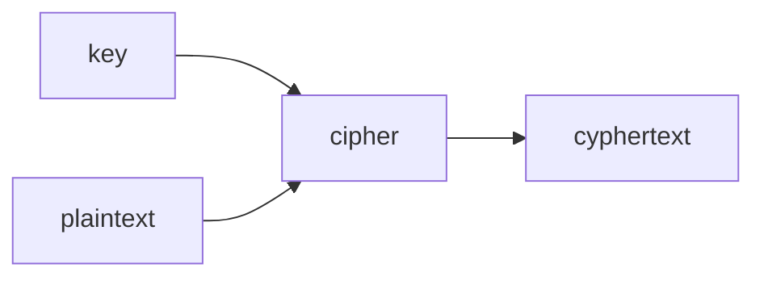

# A Deeper Glimpse of How Programming Works

## Compiling Code

- `make` is running `clang` for you.
- `make` isn't a compiler but a program that runs the compiler for you.
- `clang` can be configured with command line arguments.
  - a command line argument is additional words typed after the command to modify its output.
- `clang -o hello hello.c` is how to compile our [Hello, World!](https://github.com/maclong9/harvard-compsci/blob/main/CS50/01-C/hello.c) program.

> [!NOTE]
> Another commonly used compiler for C is `gcc`. `clang` is slightly more modern and has more readable error messages.

- compiling is a catch-all phrase for converting source code to machine code.
- compiling is one of four steps:
  - preprocessing
  - compiling
  - assembling
  - linking

### The Four Steps of Compilation

1. **preprocessing**
   - lines starting with `#` are a preprocessor directive.
   - inside of the header files there are prototypes for the functions you can use from that library.
   - it means you don't have to mess up each file by defining the same functions.
2. **compiling**
   - it's used as a catch-all phrase for the above four steps.
   - it transfers the C code into [assembly language](https://en.wikipedia.org/wiki/Assembly_language).
   - assembly was used before C
   - Before Assembly, they used [machine code](https://en.wikipedia.org/wiki/Machine_code).
   - you can see some function names and other semantics in assembly code.
3. **assembling**
   - this step takes the assembly code and converts it to machine code.
   - `clang` names its files `a.out` by default as a side effect of this.
4. **linking**
   - there are different files involved even in the simple hello, world.
   - `cs50.h`, `stdio.h` in hello, world.
   - there is a matching `.c` file for each of the header files.
     - this file contains the definition of the functions.
   - the compiler will then compile each of these.
   - finally, it will link all the separately compiled files together.

> [!TIP]
> Make sure to compile any extra files that might be used for example the [`cs50.c`](../01-C/cs50.c) file for `get_int`, `clang -o compare compare.c cs50.c` or using the `-l***` flag for a library `clang -o hello hello.c -lcs50`.

- All of the above is abstracted away from you for simplicity with `make`.
- C is a low-level language, Python is a higher-level language.
  - a higher-level language abstracts away more complex and tedious functions.
  - this makes the language easier to understand and write.

## Reverse Engineering

- This is easier said than done due to multiple ways for each thing existing. It is usually a mess because you lose function names and variable names.
- It's easier to build the program yourself than reverse engineer.

## Debugging

- It's rare to write a program 100% right the first time.
- This is because you might miss mistakes if it's your first time implementing something in particular.
- Grace Hopper is known for popularising the phrase "bug" meaning a mistake in the code.
  - It comes from a moth getting stuck in one of the relays.
- `printf` is useful for quickly seeing what's going on and finding simple mistakes.
- a debugger allows you to set a breakpoint and step through the code step by step.
- it will display the value of the relevant variables at each step.

```
bool   1 byte
int    4 byte
long   8 byte
float  4 byte
double 8 byte
char   1 byte
string ? byte
```

## Memory

- The black chips on the memory circuit board are the storage where bytes are stored.
- we call their location and address.
- the computer's memory is like a canvas you can manipulate the bits of.

> [!WARNING]
> Don't forget to [type cast](../01-C.md#type-casting) variables to floats when you need the decimal points. You can add one float to the equation and the rest convert to floats.

## Arrays

- Instead of setting a single variable for a collection of numbers you can use an array.
- For example, storing `score1...score20` would take up a lot of memory and make the code very messy.
- Instead, you can store them in an array: `int[] scores = {95, 80, 79};`
- The computer will store array values back to back.
- There is an example of this in [02-Arrays scores.c file](../02-Arrays/scores.c).

> [!CAUTION]
> Arrays start at `0`, so make sure to set the first value with `scores[0] = 3`

### Other Values

- You don't have to store numbers in the array, you can install any type in an array.
- All items in the array must be of the same type.
- A string is just an array with each item being of type `char`.
- The computer knows a string has ended when it reaches a byte that is set to `0` or `00000000`.
  - You can view this by printing the value of `array[length + 1]`.
  - it will print as `NUL`, it is equal to the `0` character in ASCII.

> [!TIP]
> You can print the value of a `char` as an `int`.

- An array of strings is just an array of arrays of `chars`.
- You can print individual characters of words such as `printf("%s", words[0][0])` would print `H` if the value of `words[0]` is equal to `"HI"`.
- If you go one index past one of the nested arrays it will access the `0`th value of the subsequent nested array.
  ```index-jump.c
  words[0] = "HI";
  words[1] = "BYE";
  printf("%s", words[0][4]); // `output: B`
  ```

> [!CAUTION]
> When refactoring a process to a function, make sure you set the variable usage to the parameter definition.

- The `<string.h>` library contains a lot of string manipulation functions.
- In the [String Length](./examples/length.c), you can see an example of a custom-defined string length function and the [strlen](https://manual.cs50.io/3/strlen) function defined in `string.h`.
- You can use `strlen` to iterate through a string using the length as the quantity to count to.
  - `for(int i = 0, n = strlen(s); i < n; i++)`
  - This is done by initialising both `i` and `n` in the initialisation.
  - The code above requires that both `i` and `n` are of the same type.
  - This is how you would print a string if you didn't know about the `%s` format code.

## ctype.h

- this library contains some useful functions for manipulating.
- in the [uppercase](./examples/uppercase.c) example you can see the `toupper` function being used.

## Command Line Arguments

- you can add `string argv[]` in the `main` function declaration as a parameter.
- this will allow you to add command line arguments to your program.
- the arguments will be stored in an array of strings.
- there is an example of this in [greet.c](./examples/greet.c).
- `argv[0]` will print the name of the program e.g. `./greet`.
  - this allows you to figure out what command the user ran so you can supply help text for them.
- if you print a number over the amount of command line arguments specified it will print `null`

> [!TIP]
> It is a good idea to allow the user to run the program without any arguments.

- you can use something called flags `./binary -f` for checking for particular arguments.

## Exit Status

- the default exit status is `0`.
- anything other than `0` is bad, it's an error code.
- debuggers and testing programs like **unit tests** can detect and display these error codes with their messages.

## Cryptography

- the ability to send information securely.
- encrypting or scrambling information is a way to ensure that no one who is the person the message is intended for can read it.
- it needs to be reversible so that someone else with the key can decrypt it.



- sending a message via plaintext is too easily read by malicious parties.
- an example crypto `HI! -> IJ!`.
  - you can only tell it is sent enthusiastically because of the `!`.
  - this method is easy to brute force.
  - it's known as the Caesar cypher because Julius Caesar used to use it.
- `ROT13` is more common and rotates them by `13`.
  - this makes it a little less obvious.
  - `26` would be useless because it rotates fully around and is back again.
- this is just a simple cipher and there are much more complex algorithms for this task.
- decrypting on the other end requires you to reverse the process with the same algorithm.
