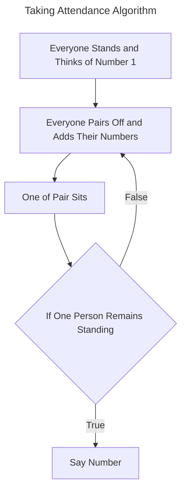
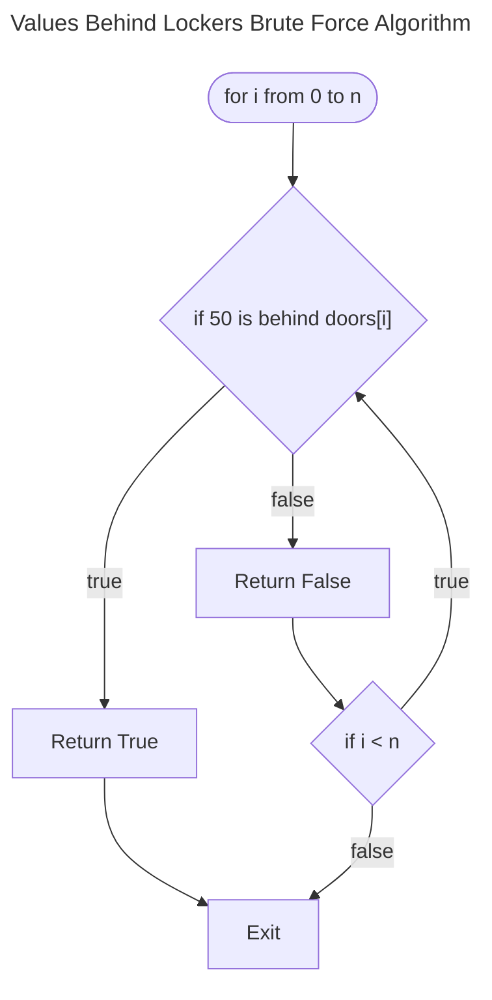
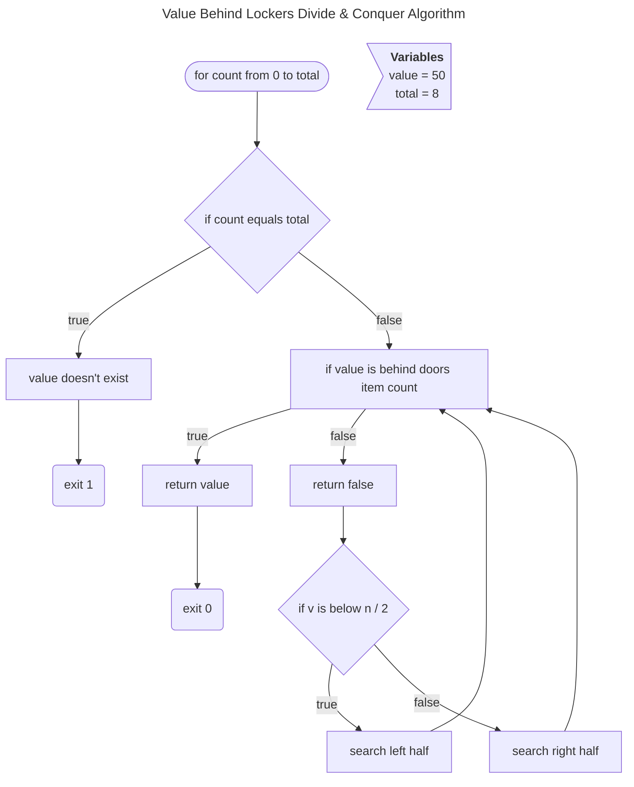
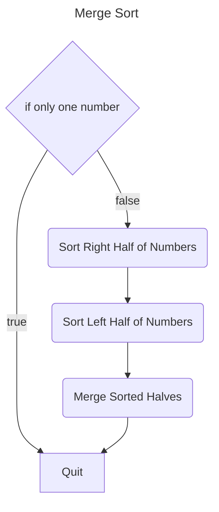

# Dividing Tasks to Conquer Faster







> [!NOTE]
> Computer Scientists tend to talk about efficiency being on the order of several steps. They also throw away constant factors such as the number, they generalise with $O(\\log n)$.

## Big $O$ Notation

- various algorithms will be described as being on the order of one of the following runtimes:

  - $O(n^{2})$: n people doing n things, for example, everyone in a room shaking hands would be $n \times n$ or $n^{2}$ handshakes. **Quadratic**.
  - $O(n \\log n)$: **Logarithmic**.
  - $O(n)$: takes linear time, for example, going through the phonebook one at a time. It represents an upper bound on the number of steps you might be counting.
  - $O(\\log n)$: dividing in half. _binary search_.
  - $O(1)$: this means it is a constant number of steps, no matter how many people the algorithm is working through.

- $\Omega$ represents a lower bound.
  - $\Omega(n^{2})$
  - $\Omega(n \\log n)$
  - $\Omega(n)$
  - $\Omega(\\log n)$
  - $\Omega(1)$: _linear search_, _binary search_

- $\Theta$ represents that $O$ and $\Omega$ are equal.
  - $\Theta(n^{2})$
  - $\Theta(n \\log n)$
  - $\Theta(n)$
  - $\Theta(\\log n)$
  - $\Theta(1)$: _linear search_, _binary search_

> [!NOTE]
> When you `return 0` it will exit the program and will not run any subsequent code.

- `strcmp` is used to compare two strings, `0` means the strings are the same.
    - `if(strcmp("test", "test") == 0)`
    - it compares strings in _ASCIIbetical_ order.

> [!NOTE]
> A code smell is when you can tell something will cause an error or problem later in the program development.

## Structs for Storing Data

- for this example, we will use the example of `Person`.
    - a person has a `string name` and a `string number`.
- we can use `typedef struct` to create a `struct`.
    - `typedef` means create a data type.
- example [here in the phonebook.c](./phonebook.c).

## Sorting Algorithms

### Find Smallest Algorithm

```mermaid
---
title: Selection Sort
---

flowchart TD
    vars>"`
      Variables
      previous = NULL
      completed = 0
      items = [0, 2, 4, 6, 1, 3, 5, 7]"]
    1(["for count in total"]) -->
    2{"if items[count + completed] less than total"}
    2 --> |true| 3
    2 --> |false| 4["move previous to start of array and add 1 to completed"]
    3["check bit at count"]
    3 --> |"smaller"| 5["store as previous"] --> 2
    3 --> |"larger"| 6["keep current bit"] --> 2
```

### Swapping Algorithm


- You can use [Comparison Sorting Algorithms](https://www.cs.usfca.edu/~galles/visualization/ComparisonSort.html) by the University of [San Francisco](https://www.usfca.edu/) to compare various common sorting algorithms and visualise how they work.
- Selection Sort takes a lot of work because it's constantly cycling through every single element above the completed amount.
    - $O(n^{2}$ - Selection sort is on the order of n steps.
    - $\Omega(n^{2})$ - The lower bound is the same.
    - This means we can represent it as $\Theta(n^{2})$.
- Bubble Sort works by comparing two values again and again.
    - $(n - 1) \times (n - 1)$
    - $n^{2} - 1n + 1$
    - $n^{2} - 2n + 1$
    - $O(n^{2}$ - Selection sort is on the order of n steps.
    - $\Omega(n)$
    - because the upper and lower bounds are different there is no $\Theta$
- Both Bubble Sort and Selection Sort are quite inefficient because $n^{2}$ can get very large.

> [!NOTE]
> You could add `if no swaps exit` to exit early if the array is sorted ahead of time to save some iterations in the case of a lucky early finish.

## Recursion

- A function that calls itself is recursive.
- An example of this is above in the Divide and Conquer algorithm that calls itself to search the left or right half.
- This will be more efficient because even though you are calling the same function recursively it's on a smaller scale each time.
- You can see this in [recursion.c](./recursion.c);
- This can tighten up the amount of code you need to write in an algorithm.
      - It also helps with memory management.

## Merge Sort

- A sort for sorting $n$ numbers that are better than both selection and bubble sorts.
- This uses recursion by running itself again on each half.
- in an example of $8$ digits
    - you sort down to $4$ and then $2$ and then $1$. For both halves.
    - then merge the full right and left half together.
    - so you sort left of the left half, right of the left half and then merge.
    - then left of the right half, right of the right half then merge.
    - then merge the left and right half.
- This algorithm uses fewer iterations.
- $\log_{2}n$ - if you start with 8, the result is how many times you can divide the problem in half.

```math
    \log_{2}8 = \log_{2}2^{3}
    \log_{2}2^{3} = 3
```

- This shows that it is not as good as linear or binary, but much better than selection or bubble.
      - $\Theta(n \log n)$
      - We do not need to display $O$ or $\Omega$ because they are equal.



In [this video](https://www.youtube.com/watch?v=ZZuD6iUe3Pc) you can see an animation which compares various sorting algorithms visually.

