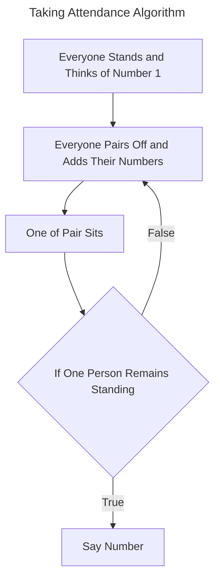
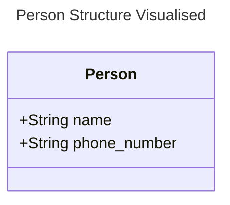
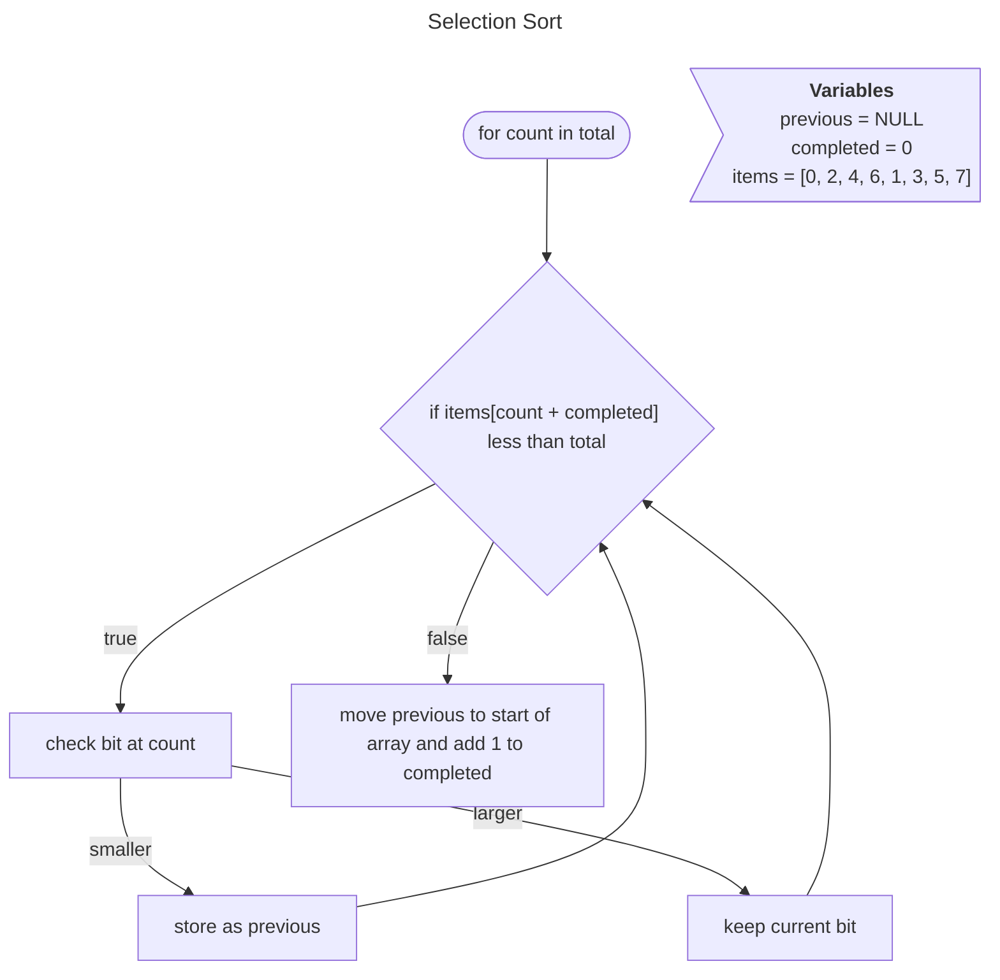
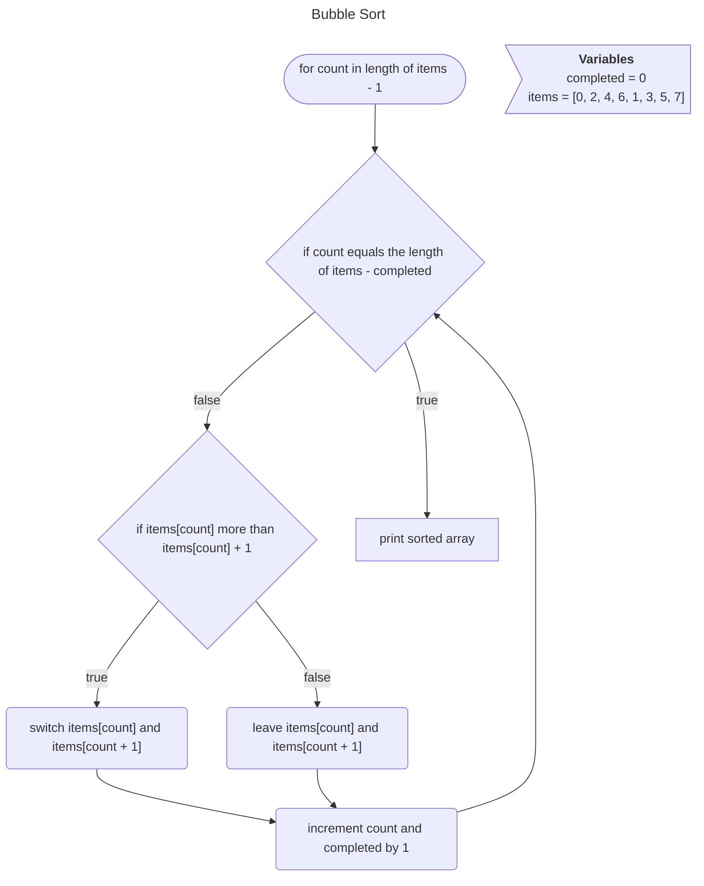
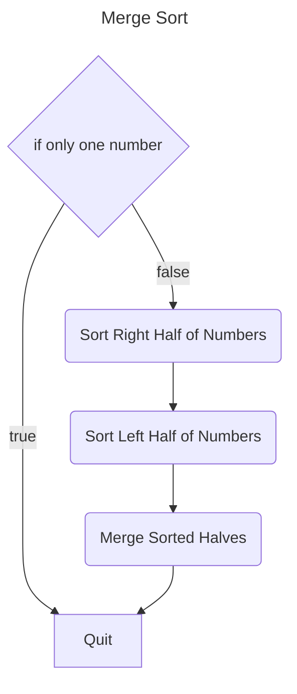

# Dividing Tasks to Conquer Faster




> [!NOTE]
> Computer Scientists tend to talk about efficiency being on the order of several steps. They also throw away constant factors such as the number, they generalise with $O(\\log n)$.

## Big $O$ Notation

This notation is a way to describe the maximum possible number of steps an algorithm can take during runtime. 

__$O$ Notation Maximum Number of Steps__
- $O(n^{2})$
     - n people doing n things, for example, everyone in a room shaking hands would be $n \times n$ or $n^{2}$ handshakes.
- $O(n \\log n)$
- $O(n)$
     - takes linear time, for example, going through the phonebook one at a time. It represents an upper bound on the number of steps you might be counting.
- $O(\\log n)$
     - dividing in half.
- $O(1)$
     - this means it is a constant number of steps, no matter how many people the algorithm is working through.

__$\Omega$ Lowest Number of Steps__
- $\Omega(n^{2})$
- $\Omega(n \\log n)$
- $\Omega(n)$
- $\Omega(\\log n)$
- $\Omega(1)$

__$\Theta$ represents that $O \text{ and } \Omega$ are equal__
- $\Theta(n^{2})$
- $\Theta(n \\log n)$
- $\Theta(n)$
- $\Theta(\\log n)$
- $\Theta(1)$: _linear search_, _binary search_

## Structs for Storing Data

A `struct` is a way of defining structure for variables and containing them within one namespace. This can help clean up code and allow more readable code. There is an example of creating a `struct` named `Person` with the attributes `string name` and `string number` for phone number within the [phonebook.c](./phonebook.c) file.




## Sorting Algorithms





> [!NOTE]
> [Comparison Sorting Algorithms](
- You can use [Comparison Sorting Algorithms](https://www.cs.usfca.edu/~galles/visualization/ComparisonSort.html) is a great website that visualises the differences between various sorting algorithms created by the University of [San Francisco](https://www.usfca.edu/). There is also [this video](https://www.youtube.com/watch?v=ZZuD6iUe3Pc) which shows the speeds of various sorting algorithms.

As an algorithm selection sort is quite inefficient as it is constantly cycling through every single element above the current loop increment. Selection Sort is on $\Theta(n^{2})$ because the upper and lower bound of steps are equal.

Bubble Sort works by comparing two values against each over, over and over again. Below is an equation that works out what the order of steps for Bubble Sort is.

```math
n = \text{Number of Items Sorted} \\

\begin{align}
     (n - 1) \times (n - 1) &= n^{2} - 1n + 1 \\
     &= n^{2} - 2n + 1 \\
     &= O(n^{2}) \\
     &= \Omega(n)
\end{align}
```

> [!NOTE]
> You could add `if no swaps exit` to exit early if the array is sorted ahead of time to save some iterations in the case of a lucky early finish.

## Recursion

So far we have spoken about _iteration_ when talking about [loops](../01-C/#loops), however there is another way to cause a repetition and that is known as __recursion__. A recursive function is a function that calls itself, an example is known as merge sort, which splits the array of numbers in half and then calls itself again on the left and right halves of the array, this means each time it is called it's on a smaller amount items, it then ends by merging the halves back together. You can see an example of recursion in [recursion.c](./recursion.c) and one of iteration in [iteration.c](./iteration.c).


Merge Sort works out as more efficient than both the Bubble and Selection sorting algorithms. The basic steps applied to a n 8 digit array would result in the array being split into half down to 4, 2 and finally 1 you'd then merge the 2 individuals sorting the values at the same time, then you'd do the same for each step back up to the full array of 8.

A more simplistic way to describe it is you sort the left half of the left half, the right half of the right half and then merge both sides of the left half of the original array, then repeat with the right half of the original array and merge the two halves of the original array.

This Merge Sort algorithm results in fewer iterations and the number of steps is equal to $log_{2}n$ and below is an example of this algorithm with 8 being $n$.

```math
\log_{2}8 = \log_{2}2^{3} \\
\log_{2}2^{3} = 3
```

```math
\Theta(n \log n)
```


