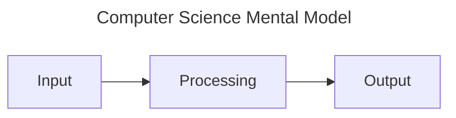
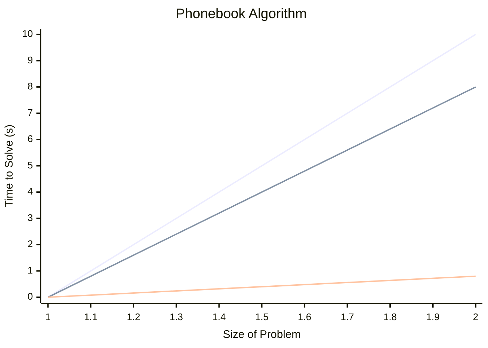
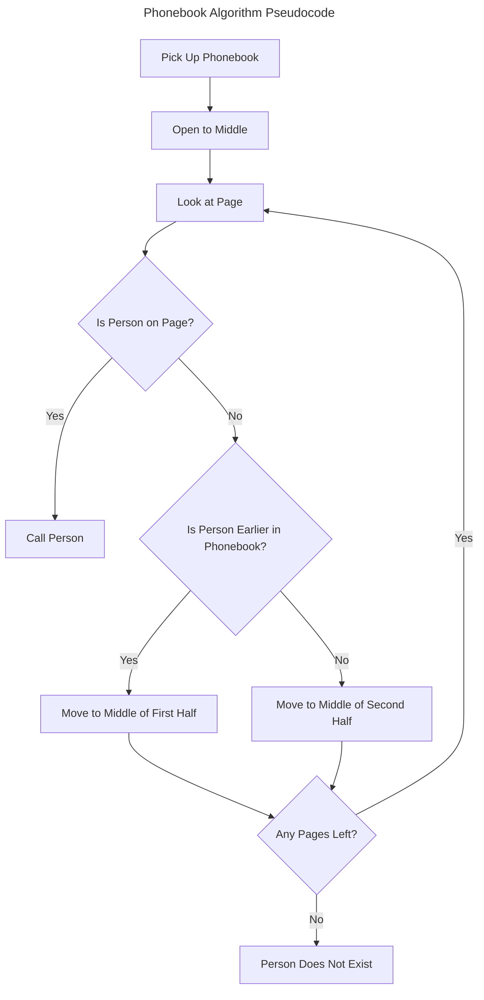

# What is Computer Science

- The study of information.
- It's about solving problems.
- Utilises computational thinking.
- A program is an input with a compute step resulting in an output.

> [!IMPORTANT] 
> These notes and examples were created following along with [Harvard CS50's Introduction to Computer Science](https://www.edx.org/learn/computer-science/harvard-university-cs50-s-introduction-to-computer-science?webview=false&campaign=CS50%27s+Introduction+to+Computer+Science&source=edx&product_category=course&placement_url=https%3A%2F%2Fwww.edx.org%2Fcs50).


<section id="Mental Model" />



## The Binary System

- Computers count in binary using `0` and `1`.
- Electricity flips the binary digits. `0` and `1` map to `off` and `on`.
- You can shorten binary digit to bit.
- Tiny switches called transistors that store or dissipate electricity.

<div align="center">

| Binary | Decimal |
| :----: | :-----: |
|  0000  |    0    |
|  0001  |    1    |
|  0010  |    2    |
|  0011  |    3    |
|  0100  |    4    |
|  0101  |    5    |
|  0110  |    6    |
|  0111  |    7    |
|  1000  |    8    |
|  1001  |    9    |
|  1010  |   10    |

</div>

In **base10** the number `123` is seen as a whole number rather than a sequence.

```math
\begin{array}{@{}c@{\,}c@{\,}c@{}}
\scriptstyle 100 & \scriptstyle 10 & \scriptstyle 1 \\
1 & 2 & 3 \\
\scriptstyle 100\times1 &
\scriptstyle10\times2 & \scriptstyle 1\times3
\end{array}
```

You can count to higher numbers with more bits. Using `3` bits at a time isn't
useful. We instead utilise `bytes` which are a collection of `8` bits or `8b`.
This is helpful for cleaner equations as it's a power of `2`.

`00000000` is Zero represented by a `byte` and `11111111` is `255`.

A byte can be represented as the following places.

| 128 | 64  | 32  | 16  | 8   | 4   | 2   | 1   |
| --- | --- | --- | --- | --- | --- | --- | --- |
| 1   | 1   | 1   | 0   | 0   | 0   | 0   | 0   |

To add binary you just need to add the value of each column with a number in it.
So that would make `11100000` equal to:

```math
128 + 64 + 32 = 224
```

> [!NOTE]
> You don't need to be able to directly translate to binary, we can view it abstractly within a programming language and just understand it is compiling down to `1`'s and `0`'s.

**What About Letters?**

Letters are represented with a number, for example, a capital `A` is represented
by `65` or `01000001`. This is a system known as `ASCII`. This gives us a
possible total of `256` letters however, for accented or script languages like
Japanese we would need more values.

The way we have so many options for characters is because we now use Unicode
instead of ASCII. Unicode uses between `1B` & `4B` for characters which gives us
roughly `4 billion` characters. Unicode's mission is to preserve all human
languages past, present and future.

Emojis are interesting because it's just a character, therefore each platform
(Apple, Google, Meta, etc) can render the image differently. Unicode uses
**base16** to map to the `bytes`, this means instead of a `4B` long number you
can use `U+1F602` or similar. uses: `0-9, a-f` representing `1-16`.

With skin tones in emojis, for example, we can add it as a modification of the
original emoji character code to change the skin tones. For example, you can use
`U+1F44D` to represent the default yellow thumbs up, to change the skin tone you
would use `U+1F44D U+1F3FD` with the second number being a modification of the
original emoji value.

This can extend further for complex emojis, using more values, for example in
the `Couple with Heart` emoji, the first value dictates the person on the left,
the two in the middle represent the heart and the one on the far right
represents the person on the right. The two identical `U+200D` are a joining
value that tells the computer to join the previous values.

```Couple with a Heart Emoji
U+1F469 U+200D U+2764 U+FE0F U+200D U+1F469
```

This is a quick demonstration to show that lots of emojis are a combination of
various emojis.

**What About Colors?**

**RGB** is a good standard for representing colours based on the value of the
red, green and blue values. Every pixel on your screen has `3B` that maps to a
value telling it how much of each colour it should use to light itself. Each
value can be up to `255`.

## Algorithms

This is what is inside the middle section between _input_ and _output_.

Code is the implementation in computers of algorithms. Looking through a
phonebook is a good analogy for an algorithm, stepping through the phonebook one
page at a time until you find the correct page with the person you're looking
for is a very simple algorithm.

A better algorithm would first jump to the middle and then calculate which side
the result would be on so if looking for `John Harvard` the phonebook would be
torn in half leaving just the first half of the book. Then just repeat by
opening at the middle and then tearing the problem in half again. Eventually,
there would be one page left that should contain `John Harvard`'s name.



This graph shows that it is better to design algorithms, like the logarithm
detailed above, that is correct and efficient.

> [!WARNING] 
> The graph only displays the efficiency and not the correctness of the algorithm.

## Pseudocode

Pseudocode is not actual code it's you writing your thoughts down tersely as
though it was a logical process. Below I have written the same pseudocode as
text and displayed it as a diagram. Writing pseudocode is a way to ensure
your program will contain everything you need before you write it, rather than
writing it and then refactoring it to fit new things in.

### Text

1. **Pick up phone book**
2. **Open to middle of phone book**
3. **Look at page**
4. _If the person is on page_
   1. **Call person**
5. _If the person is earlier in the book_
   1. **Open to the middle left half of the book**
6. _If the person is later in the book_
   1. **Open to the middle right half of the book.**
7. _If no more pages_
8. Name doesn't exist, exit
9. **_Go back to line 3_**

- **Functions** A command given to the computer.
- _Conditionals_ Usually with Boolean expressions[^1]
- **_Loops_** Repeats a section of code.

### Flowchart



## Artificial Intelligence

This requires much more than functions, conditionals and loops.

```Chatbot Pseudocode
if a student says hello
    say hello back
else if a student says goodbye
    say goodbye
```

The issue with the above is we can't hardcode every possible question, so
we need to find a way for the AI to infer the question. This
is known as a Language Learning Model, which can find patterns in a dataset
it has been trained on and then using this knowledge decide on a response based on the patterns found in
your question and the dataset. Sometimes LLM's can hallucinate wrong answers.

> [!WARNING] 
> During CS50 it is not okay to use AI that isn't CS50's [chatbot](https://cs50.ai).

## Writing Good Code

- You shouldn't repeat yourself because you have to change things in multiple
  places. Use loops instead.
- A return value is a value that can be returned from a function and can be
  stored to a variable.
- Abstract sections of code to functions for readability and reusability.

[^1]:
    An expression with a `yes` or `no` answer, invented by mathemetician
    [George Bool](https://en.wikipedia.org/wiki/George_Boole)
