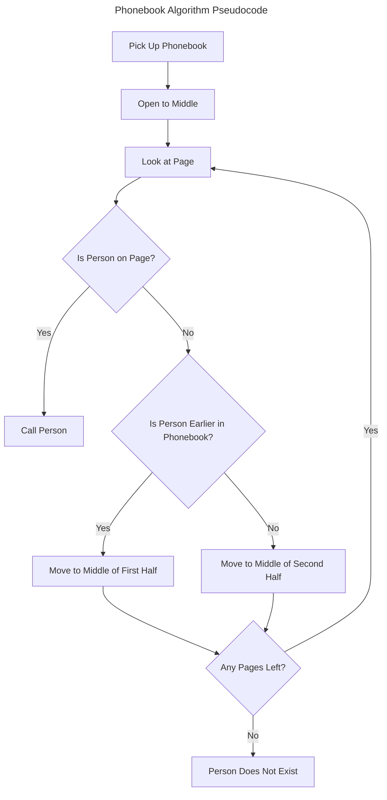

# What is Computer Science

Computer Science is the study of information, it is focused on solving problems utilising computational thinking. A program can simply be thought of as an input with a compute step resulting in an output.

> [!IMPORTANT]
> These notes and examples were created following along with [Harvard CS50's Introduction to Computer Science](https://www.edx.org/learn/computer-science/harvard-university-cs50-s-introduction-to-computer-science?webview=false&campaign=CS50%27s+Introduction+to+Computer+Science&source=edx&product_category=course&placement_url=https%3A%2F%2Fwww.edx.org%2Fcs50).

## The Binary System

Computers count in binary utilising 0's and 1's as the only two possible values. Electricity passing through transistors which can store or allow that electricity to dissipate is how a binary digit or **bit** determines its value. 

<div align="center">
    
**Counting from 1 to 10 in Binary**

| Binary | Decimal |
| :----: | :-----: |
|  0000  |    0    |
|  0001  |    1    |
|  0010  |    2    |
|  0011  |    3    |
|  0100  |    4    |
|  0101  |    5    |
|  0110  |    6    |
|  0111  |    7    |
|  1000  |    8    |
|  1001  |    9    |
|  1010  |   10    |

</div>

In **base 10** the number `123` is seen as a whole number rather than a sequence.

```math
\overbrace{1}^{100} \overbrace{2}^{10} \overbrace{3}^{1}
```

```math
\scriptstyle (100 \times 1) + (10 \times 2) + (1 \times 3)
```

You can count to higher numbers with more bits. We utilise `bytes` or `B` which are a collection of 8 `bits` or `b`. This is helpful for cleaner equations as it's a power of 2. `00000000` is 0 represented in a `byte` and `11111111` is `255`.

<div align="center">

**Column Values of Binary Bytes**
|  128  |  64   |  32   |  16   |  8    |  4    |  2    |  1    |
| :---: | :---: | :---: | :---: | :---: | :---: | :---: | :---: |
|   1   |   1   |   1   |   0   |   0   |   0   |   0   |   0   |

</div>

To add binary you just need to add the value of each column with a number in it. So that would make `11100000` equal to:

```math
\begin{align*}
11100000_2 &= (1 \times 2^7) + (1 \times 2^6) + (1 \times 2^5) + (0 \times 2^4) + (0 \times 2^3) + (0 \times 2^2) + (0 \times 2^1) + (0 \times 2^0) \\
&= 128 + 64 + 32 + 0 + 0 + 0 + 0 + 0 \\
&= 224
\end{align*}
```

> [!NOTE]
> You don't need to be able to directly translate to binary, we can view it abstractly within a programming language and just understand it is compiling down to 1's and 0's.

### What About Letters?

Letters are represented with a number, for example, a capital `A` is represented by $65_{16}$ or $01000001_{2}$. This is a system known as **ASCII**. This gives us a possible total of 256 letters, for accented or script languages like Japanese we would need more values.

ASCII was updated to a new system known as **Unicode** which uses between 1 and 4 `bytes` for characters, allowing for a total of 4 billion possible characters. The idea is for Unicode to preserve all known human languages.

Emojis are interesting because it's just a character, therefore each platform can render the image differently. Unicode uses base 16 to map to the `bytes`, this means instead of a `4B` long number you can use a hexadecimal value which looks like `U+1FF44D` the `U` prefix is a Unicode-specific identifier.

With skin tones in emojis, we can add the change in tone as a modification of the original emoji character code to change the skin tones, for example, you can use `U+1F44D` to represent the default yellow thumbs up and to change the skin tone you would use `U+1F44D U+1F3FD` with the second number being a modification of the
original emoji value.

This can extend further for complex emojis, using more values, such as the `Couple with Heart` emoji, the first value dictates the person on the left, the two in the middle represent the heart and the one on the far right represents the person on the right. The two identical `U+200D` are a joining value that tells the computer to join the left and right values.

```Couple with a Heart Emoji
U+1F469 U+200D U+2764 U+FE0F U+200D U+1F469
```

## Algorithms

Code is a way of expressing algorithms for a computer to run. Looking through a phonebook a page at a time until you find the one with the person you're looking for is a very simple algorithm.

A better algorithm would first jump to the middle and then calculate which side the result would be on so if looking for `John Harvard` the phonebook would be torn in half leaving just the first half of the book. Then just repeat by opening at the middle and then tearing the problem in half again. Eventually, there would be one page left that should contain `John Harvard`'s name.

> [!WARNING]
> The graph only displays the efficiency and not the correctness of the algorithm.

## Pseudocode

Pseudocode is writing your thoughts tersely as a logical process. Good pseudocode is a way to ensure your program will contain everything you need before you write anything, rather than refactoring to fit new things.

### Text

1. **Pick up phone book**
2. **Open to middle of phone book**
3. **Look at page**
4. _If the person is on page_
   1. **Call person**
5. _If the person is earlier in the book_
   1. **Open to the middle left half of the book**
6. _If the person is later in the book_
   1. **Open to the middle right half of the book.**
7. _If no more pages_
8. Name doesn't exist, exit
9. **_Go back to line 3_**

- **Functions** A command given to the computer.
- _Conditionals_ Usually with Boolean expressions[^1]
- **_Loops_** Repeats a section of code.

### Flowchart



## Artificial Intelligence

```plaintext
if a student says hello
    say hello back
else if a student says goodbye
    say goodbye
```

The issue with the above is we can't hardcode every possible question, so we need to find a way for the AI to infer the question. This is known as a Language Learning Model. An LLM can find patterns in a dataset and use these patterns in its decision-making process when generating a response.

## Writing Good Code

Good code should be [DRY](https://en.wikipedia.org/wiki/Don't_repeat_yourself), clean[^2] and easy to read which can be achieved by abstracting away large and regularly required processes to functions and repetitive tasks to [loops](./01-C/README.md/#loops) or [recursion](./03-Algorithms/README.md#recursion).

[^1]: Invented by mathematician [George Bool](https://en.wikipedia.org/wiki/George_Boole), an expression with a `true` or `false` answer.
[^2]: A term used to describe readable and elegant code, you can read about clean code in [this book](https://github.com/dev-marko/clean-code-book) by [Robert C. Martin](https://en.wikipedia.org/wiki/Robert_C._Martin) a software engineer and author. 
