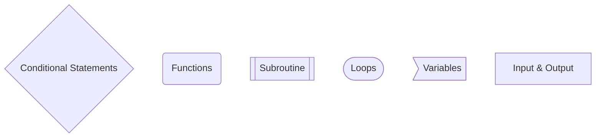

# Harvard Computer Science

Harvard University are lovely enough to publish their CS50 courses, ranging in topic from Artificial Intelligence to Cyber Security, online for free via [EDX](https://www.edx.org/cs50).

This repository contains my notes, examples and projects from these courses. Feel free to utilise my notes to aid your own learning of computer science.

## Flowchart Key

